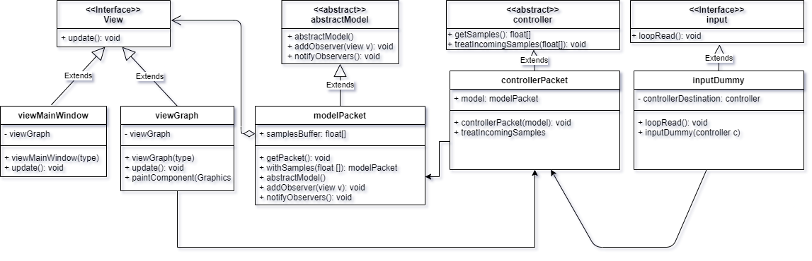

# soft oscilloscope - Developer guide
This project is structured with a Model View Controller (MVC) architecture for easy scalability.
Here is the role of a few classes:
* modelPacket: stores the current version of the data that is presented by the application.
* controllerPacket: controls the values inside the packetModel and handles the
requets for updates by the views.
* viewGraph: wait for changes on the modelPacket and update the graph according to the info given by controllerPacker.
* inputSerial: open a serial port and reads it when data is available, pushes the data to the controller for it to be handled.

## Dependencies
The project depends on the Java standard library and the swing suite of components. For the first version of the project, serial operations
are done with [the jSerialComm library](https://fazecast.github.io/jSerialComm/). The project uses maven for handling the different dependencies so
if you want to build the project locally, you shouldn't have to import the library.